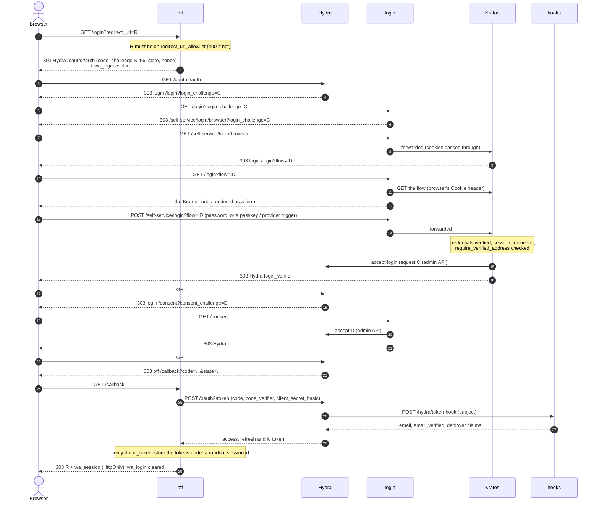

# Login flow

A login is an OAuth2 authorization-code + PKCE exchange in which `bff` is the OAuth client,
Hydra is the authorization server, and Kratos (behind `login`'s pages) is where the user proves who
they are. The browser ends up with one cookie, `wa_session` (`__Host-wa_session` under https), scoped to bff's origin; every token
stays on the server. Password, "Continue with Google" (any OIDC provider) and passkeys differ only
in the middle step; everything around them is the same.

Relevant code:
- `bff/src/server/api/login.rs`, `callback.rs`, `bff/src/server/login_cookie.rs` -- the OAuth
  client side: start, `state`/`nonce`/PKCE cookie, code exchange
- `bff/src/hydra/` -- Hydra calls and id_token verification
- `login/src/pages.rs`, `login/src/proxy.rs`, `login/src/throttle.rs` -- the Kratos UI, the one
  proxy to Kratos, the per-identifier password throttle
- `login/src/challenges.rs` -- `/consent`
- `hooks/src/server/api/token_hook.rs` -- the claims in the tokens (see [tokens.md](tokens.md))
- `ory/kratos/kratos.yml`, `ory/hydra/hydra.yml` -- the Ory configuration

## Steps

**1. `GET /login[?redirect_uri=R]`** (bff: `start_login`).

- `R` (absent or empty: `WA_DEFAULT_REDIRECT_URI`) is compared as an exact string against
  `redirect_uri_allowlist` (`WA_REDIRECT_URI_ALLOWLIST`); anything else, or neither given, is `400`,
  before Hydra is involved. bff is the only place this list lives.
- bff makes a PKCE verifier (S256), a `state` and a `nonce`, and keeps them with `R` in the
  `wa_login` cookie (`HttpOnly`, `SameSite=Lax`, 10 minutes; under https `Secure` and named
  `__Host-wa_login`, so a sibling subdomain can't plant its own). Nothing is stored server-side for a login in progress.
- It answers `303` to `{WA_HYDRA_PUBLIC_URL}/oauth2/auth` asking for `openid offline_access` and, when
  `WA_HYDRA_AUDIENCE` is set (default `weaveauth`), that `audience`.

**2. Hydra to `login`.** Hydra has no session for the browser, so it sends it to
`{issuer}/login?login_challenge=C`, which is `login`. `login`'s `/login` and `/registration` pages
only start a Kratos flow from a challenge: `303 /self-service/<flow>/browser?login_challenge=C`.
A page opened with neither a challenge nor a `?flow=` goes to bff's `/login?redirect_uri=...`
instead, taking `redirect_uri` from the query, else `WA_DEFAULT_REDIRECT_URI`; with neither it is a
`400` page. `/self-service/*` is on `login`'s host and is forwarded to Kratos by `login` alone
(per-client rate limits; Kratos is never routed directly). A `POST` to `/self-service/login` in another case or with a trailing `/` is `404`.

**3. The Kratos flow.** Kratos redirects to `/login?flow=ID`; `login` fetches the flow from Kratos
(forwarding the browser's `Cookie`; an expired flow, `404` or `410`, or one that isn't this
browser's, `403`, starts over; settings without a session, `401`, goes to `/login`) and renders its
nodes server-side: one `<form>` per group, the CSRF token as a hidden input, script nodes with
`integrity` and a per-request CSP nonce. The login screen is unified: identifier and password,
passkey and each configured provider on one page. The browser posts straight to
`/self-service/login?flow=ID`, which `login` forwards to Kratos.

- **Password.** Kratos checks the password. `login` additionally throttles the submission by
  identifier: keyed on a hash of the trimmed, lowercased identifier whatever the client address, 5
  free attempts, then one per 30 seconds, then one per 5 minutes. It is a delay, not a lockout, and
  an unknown identifier is treated like a known one. Only a response that sets a non-empty
  session cookie (`WA_KRATOS_SESSION_COOKIE`, default `ory_kratos_session`) clears the count.
  `password_identifier` is throttled like `identifier`. A body that repeats `identifier` or `method`, has both `identifier` and `password_identifier`, has
  a key in another case or with non-ASCII characters, a non-string field, or is not readable JSON
  is refused (`400`), since Kratos and the throttle could otherwise read different ones. When the
  throttle's table is full the oldest entries (those not yet delaying anyone first) make room, so a
  new identifier is always tracked. Per-client address buckets sit on top (`WA_RATE_LIMIT_MAX_ATTEMPTS` for
  submissions).
- **Google or another OIDC provider.** The provider button posts the flow with `provider=<id>`;
  Kratos answers with a redirect to the provider. The provider sends the browser back to
  `https://<login host>/self-service/methods/oidc/callback/<provider>`, which is again `login`'s
  proxy and then Kratos. Kratos maps the id_token claims into identity traits with the provider's
  Jsonnet mapper and sets a verified email address **only** when the provider's id_token says
  `email_verified: true`.
  - Known provider identity: signed in.
  - New email: an identity is created with the provider linked (see
    [registration.md](registration.md) for what follows).
  - The email belongs to an identity that has no link to this provider: Kratos does not link on the
    email alone (`account_linking_mode: confirm_with_existing_credential`). The user must first sign
    in with that identity's own credential (for a password account, the password), and only then is
    the provider linked. A provider that returns an unverified email cannot be used to take over an
    address this way, because the existing credential is always required.
- **Passkey.** The passkey node carries a Kratos trigger name; `/ui.js` (compiled into `login`,
  the only script other than Kratos' own script nodes) binds it and calls the browser's WebAuthn
  API with what Kratos' script provides. The relying party id is the login host.

When the identity's email address is **not verified**, Kratos does not finish the login
(`require_verified_address`, which covers password, passkey and provider logins). It starts a
verification flow instead and mails a 6-digit code; Hydra's login request stays unaccepted. This
verification-first behaviour is the default and can be switched off, see
[registration.md](registration.md#verified-email-first).

**Known gap.** When the code is entered in a verification flow that a *login* started, the address
becomes verified but the flow ends on Kratos' `/error` page (rendered by `login`'s `/error`)
instead of continuing to Hydra. The user signs in again from the application, and that second login
passes. A verification started by a *registration* does continue (see
[registration.md](registration.md)). Either way the verification hook runs once the code is
accepted, so `verification_handler` is told about the address (see
[registration.md](registration.md#verified-email-first)).

**4. Accepting the login and consent.** On success Kratos (configured with
`oauth2_provider.url` = Hydra's admin API) accepts Hydra's login request itself and redirects to
Hydra. Hydra then sends the browser to `login`'s `/consent` (`skip_consent` on the client does not
bypass it). `/consent` accepts only when the client is `WA_BFF_CLIENT_ID` (default `bff`) and every
requested scope is `openid` or `offline_access`, granting the scopes and the requested
audience (Hydra only puts `aud` in the access token when consent grants it); anything
else is rejected. There is no consent screen.

**5. `GET /callback`** (bff: `callback`). In order:

1. The `wa_login` cookie must be present, once (`400` otherwise) and its `state` must match the query's,
   compared in constant time (`400`). A query with `error` is `400` too (Hydra's error text is
   only logged).
2. The `redirect_uri` kept in the cookie is checked against the allowlist again (the cookie is the
   browser's to edit).
3. bff redeems the `code` with the PKCE verifier at Hydra's **internal** token endpoint
   (`WA_HYDRA_INTERNAL_URL`, `client_secret_basic`). A rejected code is `400`; Hydra unreachable
   `502`. During the exchange Hydra calls hooks' token hook for the claims.
4. It verifies the id_token (RS256 signature against Hydra's JWKS, `iss`, `aud`, `nonce`, `at_hash`) and
   keeps the `sub` (the Kratos identity id) and the `sid` (Hydra's login session id). An id_token or
   refresh token missing from the response is `502`.
5. It stores `{access, refresh, id_token, expiry, sub, sid}` under a random session id, in memory,
   and answers `303` to the `redirect_uri` with `Set-Cookie: wa_session=<id>; HttpOnly;
   SameSite=Lax; Max-Age=<refresh token TTL>` (`Secure` and `__Host-` prefixed under https) and clears
   `wa_login`. No token is ever in a URL or readable by the browser. A `wa_session` the browser
   sent along, from an earlier login, ends with this one: its session is dropped and its refresh
   token revoked at Hydra (only once the new login succeeded).

bff's sessions are in memory: restarting bff ends every session (users sign in again, which is
silent while their Kratos and Hydra sessions last).

## Rate limits

Per client address (`WA_TRUSTED_PROXIES` decides which address that is behind a proxy):

- bff's `/login`, `/callback`, `/logout` and `/logged-out` share one bucket,
  `WA_RATE_LIMIT_MAX_ATTEMPTS` (10 a minute in `prod`, 100 in `dev`).
- login has two buckets: submissions (`POST` through the Kratos proxy), sized by
  `WA_RATE_LIMIT_MAX_ATTEMPTS` too, and everything else (pages, flow starts, `GET`s through the
  proxy), 600 a minute in `prod` (6000 in `dev`, code-only).
- `/health` on bff is exempt.
