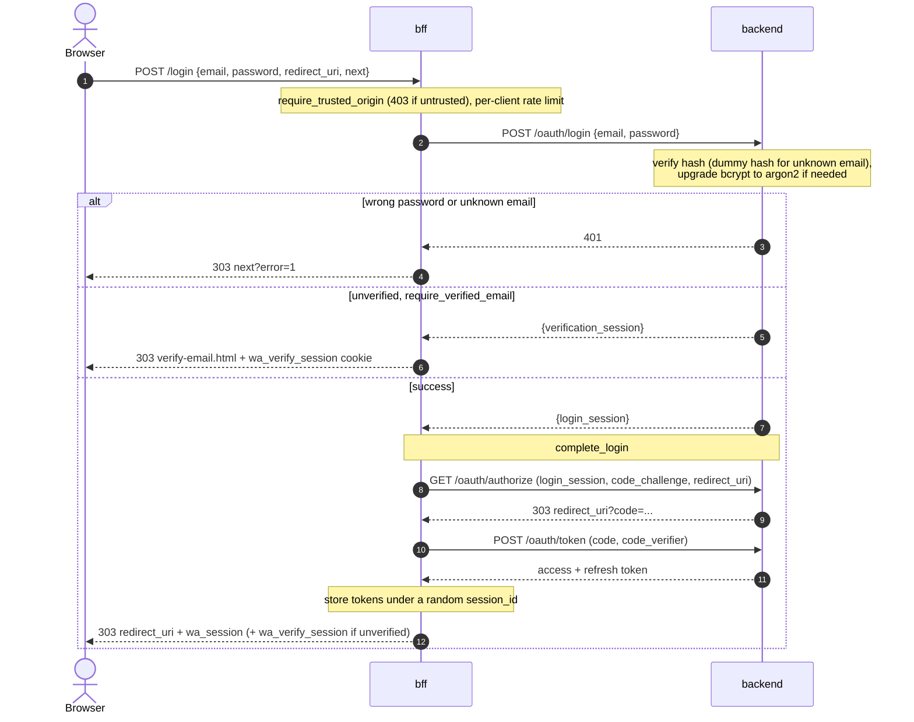

# Login flow

Password login spans both services, same as [OIDC](oidc.md): `bff` (browser-facing,
mints the session cookie) and `backend` (owns user data, verifies the password, issues
the OAuth-shaped code/token pair). There's no third party and no PKCE dance visible to
the browser -- bff drives the whole authorization-code exchange server-to-server right
after backend confirms the password, converging on the same `complete_login` helper the
OIDC flow uses once it has a `login_session`.

Relevant code:
- `bff/src/server/api/login.rs` -- browser-facing endpoint, credential check
- `bff/src/server/api/complete_login.rs` -- shared PKCE exchange + session cookie
  (also used by the OIDC flow)
- `backend/src/server/api/login.rs` -- password verification, `login_session` issuance
- `backend/src/server/api/authorize.rs` -- `login_session` -> auth code
- `backend/src/server/api/token.rs` -- auth code -> access/refresh token pair
- `backend/src/crypto.rs` -- argon2/bcrypt hashing and verification primitives
- `backend/src/server/api/mod.rs` -- `upgrade_bcrypt_to_argon2` (service-layer helper
  shared by `login.rs` and `oidc.rs`; depends on both `crypto` and `storage`, which is
  why it doesn't live in `crypto.rs` itself)
- `backend/src/model/user.rs` -- `PasswordHash` (the `Argon2`/`Bcrypt` tagged hash)

## Steps

**1. `POST /login`** (bff: `start_login`) -- the login form's submit target.

- `require_trusted_origin` runs first, before backend is contacted at all -- an
  untrusted `Origin`/`Referer` gets `403` immediately, without spending a round trip.
  Same login-CSRF concern as `/register` and OIDC's confirm-link step.
- Posts `{email, password}` to backend's `POST /oauth/login`.
  - Backend `401` -> `LoginOutcome::Rejected` -> bff redirects the browser back to
    `next?error=1`. A plain form POST, not a fetch, so a friendly bounce is what the
    browser shows, not a bare 401 body.
  - Backend returns only a `verification_session` (`require_verified_email` and the account
    isn't verified) -> `LoginOutcome::VerificationRequired`: no `wa_session`, a restricted
    `wa_verify_session` cookie and `303` to login's `verify-email.html`
    ([verify email](verify-email.md)).
  - Any other non-2xx -> `LoginError::BackendUnavailable` (`502`).
- On success, backend's response carries a `login_session`; bff hands it to
  `complete_login`, which drives the authorization-code + PKCE exchange
  server-to-server, sets `wa_session`, and redirects the browser to the caller's
  `redirect_uri`.

**2. `POST /oauth/login`** (backend: `login`) -- password verification.

- Email normalized (`normalize_email`) before lookup.
- Always verifies against *some* hash, even for an unknown email: a fixed
  `DUMMY_PASSWORD_HASH` (a real argon2 hash of a made-up password) substitutes, so an
  unknown email pays the same argon2 cost as a wrong password on a known one --
  closing off email enumeration via response timing.
- `crypto::verify_password` matches on the stored hash's scheme:
  - `Argon2` -- parsed as a PHC string, verified against the shared `ARGON2` instance.
  - `Bcrypt` -- only ever exists on an account imported from a legacy store; this app
    never writes one. Its own cost factor is checked against `max_bcrypt_cost`
    (bcrypt's default cost (12), fixed in code) before verifying -- an inflated cost claimed by an imported
    hash could otherwise tie up a blocking-pool thread for a long time. Verification
    time still isn't covered by the dummy-hash timing guard (the dummy is argon2), so
    a bcrypt account's login timing still depends on its own cost; the cap bounds how
    bad that leak can get without closing it.
- A successful bcrypt verification calls `upgrade_bcrypt_to_argon2`, which re-hashes
  the password with `crypto::hash_password` and overwrites the stored hash via
  `upgrade_password_hash`, inline, in the same request. The write only happens if the
  account's `credential_version` still matches the one the password was checked against,
  so a password reset landing during the re-hash isn't overwritten with the old
  password. The same helper is called from `/oauth/oidc/confirm-link` (oidc.rs) when that
  path verifies a legacy bcrypt hash, so the upgrade behavior can't drift between the two
  call sites. A failure to upgrade (hashing error, or a reset in between) is logged
  (`tracing::warn!`) but never fails the login -- the password was already confirmed
  correct.
- An account whose `email_verified` is `false` also gets a `verification_session`; with
  `require_verified_email` set that is *all* it gets (no `login_session`, and the code email is
  sent). This happens only after the password verified, so a wrong password still gets `401`
  and the response can't be used to probe which addresses are registered.
- On success, `login_sessions.create_session(user.stamp())` mints a single-use
  `login_session` token (fixed at 60s) and returns it. The stamp records the account's
  `credential_version` as of the password check, so a password reset since then makes
  the session worthless ([password reset](password-reset.md#every-earlier-credential-dies)).

**3. `GET /oauth/authorize`** (backend: `authorize`) -- called by `complete_login`,
never the browser directly.

- Redeems `login_session` (single-use, `take_session`) -> `401` if missing, unknown,
  already used, or issued before the account's latest password reset.
- Checks `redirect_uri` against `redirect_uri_allowlist` -- exact string match.
- Mints a single-use `auth_code` bound to the PKCE `code_challenge`,
  `code_challenge_method`, `redirect_uri`, and the login session's
  `CredentialStamp` (user id and credential version), and redirects to
  `redirect_uri?code=...`.

**4. `POST /oauth/token`** (backend: `issue_token`) -- also called by `complete_login`.

- `grant_type=authorization_code`: redeems `auth_code` (single-use), checks
  `redirect_uri` matches what the code was issued for, checks `code_verifier` hashes
  to the stored `code_challenge`.
- Mints an access token (RS256 JWT; claims `iss` (`WA_BACKEND_URL`), `sub`, `email`,
  `email_verified`, `iat`, `exp`) and a fresh opaque refresh token in a new
  `family_id`.
- `grant_type=refresh_token`: redeems and rotates a refresh token; replaying an
  already-rotated token revokes the whole family.

`complete_login` stores the resulting access/refresh token pair server-side
(`InMemorySessionStorage`, keyed by a random `session_id`) and returns the `Set-Cookie`
header for `wa_session` -- the browser only ever holds an opaque session id, never the
JWT or refresh token directly.

## Legacy bcrypt import

There is no import endpoint or CLI yet. A legacy user is imported by calling
`UserStorage::create_user` directly with `password: Some(PasswordHash::Bcrypt(hash))`.
From then on the flow above handles it: the first successful login verifies the bcrypt
hash and silently upgrades the account to argon2, so bcrypt is only ever read, never
written by this app.

## Known gaps

- **No rate limiting on `/oauth/login`** itself (bff's `/login` has
  the `WA_RATE_LIMIT_MAX_ATTEMPTS`-configured [per-client rate limit](../../README.md#bff-routes); backend's own endpoint, reachable
  directly by anything on the internal network, does not).
- **No legacy-user import endpoint** -- see above.
