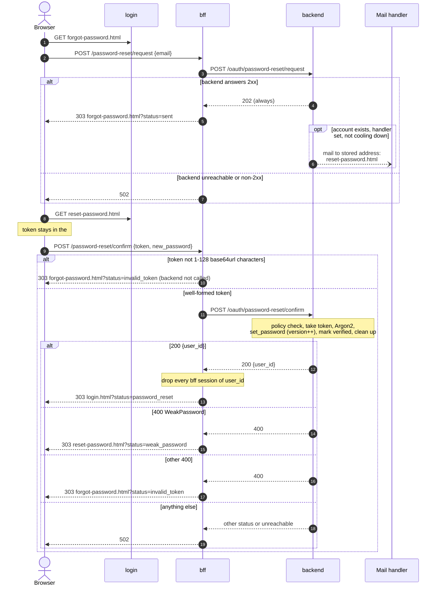

# Password reset flow

A user who can't sign in asks for a reset link by email, opens it, and chooses a
new password. This is also how the real owner of an address takes an account
back from someone who registered it first: confirming an OIDC link needs the
account's current password (see [OIDC](oidc.md)), and a reset gives them one.

Pages live in `login`, the browser-facing routes in `bff`, and the work in
`backend`:

- `templates/pages/forgot-password.html`, `templates/pages/reset-password.html`,
  `login/static/reset-password.js`
- `bff/src/server/api/password_reset.rs` -- `/password-reset/request`, `/password-reset/confirm`
- `backend/src/server/api/password_reset.rs` -- `/oauth/password-reset/request`, `/oauth/password-reset/confirm`
- `backend/src/email.rs` -- delivery, shared with [verify email](verify-email.md)
- `backend/src/storage/in_memory.rs` -- `InMemoryPasswordResetTokenStorage`



## Steps

**1. Ask for a link.** `forgot-password.html` (linked from the login form, from
the link-confirm view next to its password field, and from the verification
page once the account is locked until a reset) posts `email` to bff's
`POST /password-reset/request`. bff checks the `Origin`, forwards
`{"email"}` to backend and always answers with a 303 to
`forgot-password.html?status=sent` ("if an account uses that address, a link is
on its way"). It answers 502 only if backend is unreachable or errors, which says
nothing about any account.

**2. Backend issues and mails the token.** `POST /oauth/password-reset/request`
always answers **202**. It looks the address up with `normalize_email`, then
mails nothing when:

- no account matches,
- no email handler is configured (backend warns about that once at startup), or
- the account got a token less than `password_reset_resend_cooldown_secs` (60s)
  ago.

Otherwise `issue_reset_token` mints 32 CSPRNG bytes, base64url, and stores
`sha256(token) -> (user_id, issued_at)`. The user's earlier tokens stay valid
until one of them is redeemed (see below). The mail goes in a background task to the
**account's stored address**, never to the request's input: `Alice+x@Example.com`
finds `alice@example.com`'s account, and the link goes to `alice@example.com`.
The link is

```
{login_public_url}/reset-password.html#token=<token>
```

The token is in the **fragment**, which browsers never send to a server or in a
`Referer`. The response is the same whether or not an account exists or a mail
went out, and the mail is sent in the background so SMTP or the plugin adds no
delay. This is not a timing-proof guarantee: a known address still costs a token
lookup and a hash more than an unknown one, and backend's own logs name the
account on the cooldown path. `/register` answers `409` for a taken address anyway,
so this endpoint isn't the easiest way to find out who has an account.

**3. Open the link.** login serves `reset-password.html` with
`Referrer-Policy: strict-origin` and `Cache-Control: no-store`. Not
`no-referrer`: under it the browser sends `Origin: null` on the form's POST,
which bff refuses; and no policy ever puts the fragment in a `Referer`. Its
script copies the token from the fragment into a hidden form field and into the
tab's `sessionStorage`, and removes the fragment from the address bar with
`history.replaceState`. On a reload, or after a rejected password, the field is
filled from `sessionStorage` again. The form starts hidden and the script shows
it only once it has a token. Without one, the script shows "open the link from
your email again" instead (a `<noscript>` copy covers a browser without JS), so
the user isn't sent to a submit that would fail as an expired link. The two
pages a reset ends on (`login.html?status=password_reset`,
`forgot-password.html?status=invalid_token`) remove the token from
`sessionStorage`. Opening the page changes nothing, so a mail scanner that
follows links can't spend the token.

**4. Submit the new password.** The form posts `token` and `new_password` to
bff's `POST /password-reset/confirm`. bff checks the `Origin`, refuses a token
that isn't 1-128 base64url characters without calling backend, forwards the
rest, and redirects:

| Backend answer           | bff redirects to                                         |
|--------------------------|----------------------------------------------------------|
| 200 `{user_id}`          | `login.html?status=password_reset`, after dropping every bff session of `user_id` |
| 400 `WeakPassword`       | `reset-password.html?status=weak_password` (no token; the page still has it) |
| other 400, bad token     | `forgot-password.html?status=invalid_token`              |
| anything else            | 502                                                      |

The user is **not** signed in: they sign in with the new password next. A forged
confirm therefore can't drop someone into an account that isn't theirs. Every
redirect goes to a fixed page on `login_public_url`; nothing from the request
picks the destination. Neither the reset link nor these redirects carry a
`redirect_uri`, so the login page reached with `status=password_reset` and
`forgot-password.html` use `WA_EMAIL_LINK_DEFAULT_REDIRECT_URI`, like the
verification page, else `WA_DEFAULT_REDIRECT_URI`, else login's own origin.

**5. Backend redeems the token.** `POST /oauth/password-reset/confirm`:

1. `validate_new_password` (at least 8 characters, at most 1024 bytes; the same
   rule as `/register`). Failure is a 400 `WeakPassword`, and the token is still
   good, because this check runs before the token is touched.
2. `take_reset_token` removes the entry. Unknown, used, or older than
   `password_reset_token_ttl_secs` (30 minutes) gives a 400 `InvalidOrExpiredToken`.
   A good token also spends every other token the user still holds.
3. Argon2 hash on `spawn_blocking`.
4. `set_password`, which also bumps the user's `credential_version`.
5. `mark_email_verified`: redeeming the token proves control of the mailbox.
6. Clean-up: revoke the user's refresh tokens, login sessions and verification
   sessions, and clear their verification-code state (code, cooldown, failure
   count, lockout). A failure here is logged and the reset still succeeds:
   the password is already changed, and the stale credentials are refused anyway
   (below).
7. Answer `200 {"user_id"}`, so bff can end that user's sessions.

## Every earlier credential dies

### Why revoking isn't enough

"Revoke all of the user's sessions and tokens" only deletes what exists at that
instant. Anything still being issued slips through:

1. An attacker who knows the old password starts a login. Backend reads the user
   and starts the slow Argon2 check against the old hash.
2. The owner's reset completes: new password, everything revoked.
3. The attacker's check finishes ("password correct") and backend creates a
   login session, *after* the revocation. The attacker is in.

A refresh-token rotation or an authorization code in flight has the same race.
So revocation (step 5, item 6) is only clean-up; the guarantee is the
credential version.

### Credential versions

Every `User` has a `credential_version`. `set_password` bumps it under the same
lock that writes the hash, so no reader ever sees the new hash with the old
version or the other way round:

```rust
user.password = Some(password_hash);
user.credential_version += 1;
```

Login sessions, authorization codes, refresh tokens and verification sessions
each carry a `CredentialStamp { user_id, version }`, taken from the same user
snapshot whose password (or provider sign-in) was checked:

```rust
let login_session = state.login_sessions.create_session(user.stamp()).await;
```

Every place that redeems one goes through one gate, which refuses the stamp once
the version has moved on:

```rust
pub(crate) async fn current_user(users: &impl UserStorage, stamp: CredentialStamp) -> Option<User> {
    users
        .get_user_by_id(stamp.user_id)
        .await
        .filter(|user| user.credential_version == stamp.version)
}
```

- `/oauth/authorize` refuses a login session (`InvalidLoginSession`),
- `/oauth/token` refuses a code (`InvalidCode`) or refresh token (`InvalidRefreshToken`),
- the email-verification endpoints refuse a verification session (`InvalidSession`).

For example, the refresh grant:

```rust
RefreshTokenOutcome::Valid { stamp, family_id } => {
    let user = current_user(&state.users, stamp)
        .await
        .ok_or(TokenServiceError::InvalidRefreshToken)?;
    issue_tokens(state, user, family_id).await
}
```

Back to the race: the attacker's late session carries the old version, so
`/oauth/authorize` refuses it the first time it's used. Timing no longer
matters. A rotated refresh token keeps its predecessor's stamp, so a token family
started before the reset can't refresh itself into a valid one.

### Writes guarded by the version

Two writes that come out of an old proof are refused the same way:

- **Upgrading a bcrypt hash** (`upgrade_password_hash`) writes only while the
  version still matches. Otherwise a login re-hashing the *old* password could
  overwrite the new one.
- **Linking an OIDC identity** (`link_verified_oidc_identity`) after a confirm-link
  password check writes only while the version still matches. A link outlives
  any session, so one approved by the old password must not land afterwards.

### Access tokens

Access tokens never reach the browser: bff holds them, keyed by the session
cookie. On a done reset bff drops every one of the user's sessions
(`SessionStorage::revoke_all_for_user`), so the access tokens it held stop being
used at once, on every device. This relies on resets coming in through bff, which
holds because backend is never public. A trusted internal service that calls
backend's confirm itself has to do the same with the returned `user_id`.

## Attacks and defences

| Attack | Defence |
|--------|---------|
| Account enumeration | `/request` always answers 202 and bff always lands on the same "if an account exists" page; the mail goes out in the background. Not timing-proof (step 2). |
| Mail sent to an attacker's address (`email: [victim, attacker]`, look-alike addresses) | The mail goes to the stored address of the matched account, never the typed one; a JSON array is rejected. |
| Host-header injection into the link | The link is built from configured `login_public_url`, never from request headers. |
| Token leaking via logs, proxies, `Referer`, history | Token only in the URL fragment, removed from the address bar; page is `no-store`; no redirect, response or log line carries it. |
| Mail scanners following the link | Opening the page has no side effect; only the form POST spends the token. |
| Brute-forcing or dumping tokens | 256-bit CSPRNG token; stored only as `sha256(token)`. |
| Two confirms racing with one token | `take_reset_token` removes the entry atomically. |
| Email bombing | Silent 60s per-user cooldown plus bff's per-IP rate limit. Backend refuses to start with a cooldown <= 0, since it also caps the live tokens per user. |
| Re-requesting to kill the owner's link | Earlier links stay valid; redeeming any one spends them all. |
| A weak password spending the token | The password policy runs before the token is taken. |
| Empty or huge password via the API | `validate_new_password`: >= 8 characters, <= 1024 bytes (bounds Argon2 work). |
| Login, code exchange or refresh racing the reset | Credential stamps: anything issued under the old `credential_version` is refused on first use (see above). |
| bcrypt upgrade or OIDC link writing back after the reset | Both write only while the version still matches. |
| Squatter keeping access | Version bump plus clean-up ends their sessions, codes, refresh tokens and verification state; the password is overwritten and the email marked verified. |
| Access tokens outliving the reset | bff drops every session of the user, on every device. |
| CSRF on the forms | `Origin` check on both bff POSTs; a confirm never signs anyone in. |
| Open redirect | bff redirects only to fixed pages on `login_public_url`. |
| Header injection via the token | bff accepts only 1-128 base64url characters and refuses anything else without calling backend. |
| Log spam by unauthenticated callers | "No email handler" is warned once at startup; the per-request line is `debug`. |

## Token summary

| Property       | Value                                                        |
|----------------|--------------------------------------------------------------|
| Entropy        | 32 bytes CSPRNG (`rand::rng()`), base64url, no padding       |
| At rest        | `sha256(token)` as the map key; the token itself never stored|
| TTL            | `Tuning.password_reset_token_ttl_secs`, 30 minutes           |
| Reuse          | Single-use; a rejected password doesn't spend it             |
| Per user       | Several live tokens (at most TTL / cooldown); redeeming one spends all |
| Issuing        | At most one per `password_reset_resend_cooldown_secs` (60s)  |
| Transport      | URL fragment of login's reset page; then a form field and the tab's `sessionStorage` |
| Expiry cleanup | `sweep_expired`, run by the background task in `AppState`    |
| Exposure       | Never in a response, a header or a log line; only the mail, its handler, and the resetting tab's `sessionStorage` until the reset ends |

Unsalted SHA-256 is fine here: the input is 256 bits of CSPRNG output, so there
is nothing to brute-force, and the lookup has to be deterministic.

The cooldown is per user and silent. bff's per-IP rate limit covers both routes
(the auth bucket). An attacker can still mail the owner a fresh link once a
minute, but that doesn't invalidate the link the owner already has: every link
stays good until it expires or the owner redeems one. A leaked older link is no
worse than a leaked newer one, since all of them went to the same inbox.

## Delivery

Reset mails go through the same handler as verification codes (`email_handler`:
SMTP, webhook or plugin; see [verify email](verify-email.md#sending-the-code)):

- **SMTP** renders `templates/emails/password-reset.{subject.txt,txt,html}` with
  `email`, `reset_url` and `expires_at`. Backend refuses to start if any of them
  is missing.
- **Webhook** gets `{"kind": "password_reset", "user_id", "email", "reset_url",
  "expires_at"}`.
- **Plugin** gets hook `password_reset` with `data` `{reset_url, expires_at}`
  (see [plugins](../plugins.md)).

Whoever delivers the mail sees the link, the same as with verification codes.
