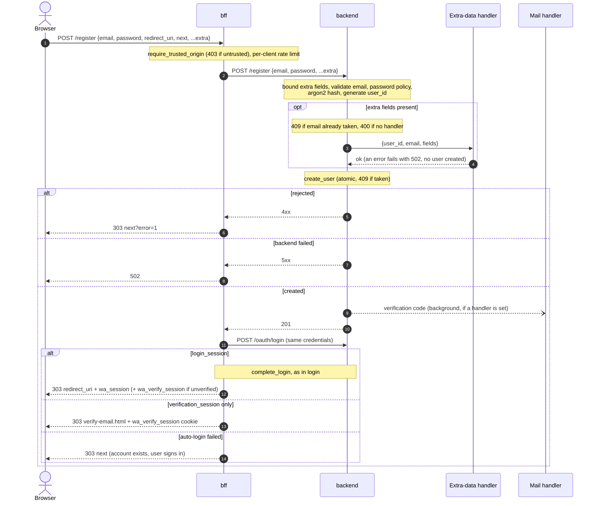

# Registration flow

Registration spans both services the same way [login](login.md) does: `bff`
(browser-facing, owns the session cookie) and `backend` (owns user data, hashes the
password). A successful registration immediately logs the new user in, so the browser
lands on the caller's `redirect_uri` with `wa_session` already set rather than being
bounced to the login page to type the same credentials again.

A deployment can also accept arbitrary extra form fields alongside `email`/`password`
and forward them to a handler it configures. WeaveAuth never stores them.

Relevant code:
- `bff/src/server/api/register.rs` -- browser-facing endpoint, forward + auto-login
- `bff/src/server/api/complete_login.rs` -- shared PKCE exchange + session cookie
- `backend/src/server/api/register.rs` -- validation, hashing, user creation
- `backend/src/server/api/register.rs` (`extra_data` module) -- `ExtraDataHandler`
  trait, webhook handler and the adapter onto the generic plugin runtime
- `backend/src/server/api/email_verification.rs` -- the verification email sent on success
- `backend/src/plugin/` -- the plugin runtime and its capabilities ([docs](../plugins.md))
- `backend/src/crypto.rs` -- argon2 hashing primitives

## Steps

**1. `POST /register`** (bff: `start_register`) -- the registration form's submit target.

- `require_trusted_origin` runs first, before backend is contacted -- an untrusted
  `Origin`/`Referer` gets `403` without spending a round trip. Same login-CSRF concern
  as `/login`.
- Rate-limited per client ([bff routes](../../README.md#bff-routes)) in the shared auth bucket
  (`WA_RATE_LIMIT_MAX_ATTEMPTS`), the same one
  `/login` and the OIDC routes use, so registration spam can't burn the proxy's budget
  or get its own.
- The form's named fields are `email`, `password`, `redirect_uri` (where the browser
  goes on success) and `next` (where it goes on failure). Anything else the form
  submits is collected by `#[serde(flatten)] extra` and forwarded to backend as-is;
  `redirect_uri` and `next` are bff's own and are never forwarded.
- Posts `{email, password, ...extra}` to backend's `POST /register`.
  - Backend 4xx -> `RegisterOutcome::Rejected` -> `303` to `next?error=1`. A plain
    form POST, not a fetch, so the browser gets a friendly bounce rather than a bare
    error body. Every backend rejection reason collapses into this one destination --
    `register.html`'s static copy has no way to distinguish them.
  - Backend 5xx (including a failed extra-data handler) ->
    `RegisterError::BackendUnavailable`, a bare `502` with no redirect.
  - Backend `201` -> `RegisterOutcome::Created`, continue below.
- `auto_login` then replays the same credentials against backend's `POST /oauth/login`
  and hands the resulting `login_session` to `complete_login`, which drives the
  authorization-code + PKCE exchange server-to-server and returns the `Set-Cookie`
  header. On success: `303` to `redirect_uri` with `wa_session` set. If auto-login
  fails for any reason, the account still exists, so the browser gets `303` to `next`
  without an `error=1` -- the user can log in normally.
- This endpoint is the one bff route carrying aide/OpenAPI metadata
  (`start_register_doc`); the schema endpoints that publish it are off unless
  `WA_DOCS_ENABLED` is set. See `bff/AGENTS.md`.

**2. `POST /register`** (backend: `register`) -- validation, hashing, user creation.

Order matters here; each step gates the next.

- **Extra-field bounds** are checked before anything else touches them: at most 50
  fields, each key and value at most 4096 bytes, else `400`
  (`ExtraDataTooLarge`). Without this a single request could hand an unbounded payload
  to a webhook or plugin process, limited only by axum's default body-size cap.
- **Email** is normalized (`normalize_email`) then validated (`EmailAddress::is_valid`)
  -> `400` (`InvalidEmail`).
- **Password policy** (`validate_new_password`: at least 8 characters, at most 1024
  bytes) -> `400`.
- **Password** is hashed with argon2 (`crypto::hash_password`, on the blocking pool).
- **`user_id` is generated up front**, not left to storage, so the extra-data handler
  can be told which user the fields belong to before that user exists.
- **Extra fields**, when present:
  - The email is checked for an existing account first -> `409` (`EmailTaken`).
    Without this pre-check, a caller could repeatedly post an already-taken email with
    extra fields and have the handler fire every time before `create_user` rejected the
    request -- an unlimited way to inject arbitrary data into the deployer's handler for
    someone else's account.
  - No handler configured -> `400` (`ExtraDataNotSupported`). Extra fields are opt-in;
    a deployment that hasn't configured a handler rejects them rather than dropping them
    silently.
  - The handler is called with `{user_id, email, fields}`. Any error -> `502`
    (`DownstreamServiceFailed`) and **no user is created**. Registration is only
    committed once the handler has accepted the extra data.
- **`create_user`** performs an atomic check-and-insert -> `409` (`EmailTaken`) if the
  email was taken in the meantime. `email_verified` is `false` until the address is
  confirmed, by entering the emailed code ([verify email](verify-email.md)) or by an OIDC provider
  (see [OIDC](oidc.md)).
- With an `email_handler` configured, a verification email with a 9-digit code is then sent
  in a background task. If backend requires verification, bff's auto-login then gets only a
  verification session and sends the new user to the code page rather than into the app
  ([verify email](verify-email.md)). A delivery failure is logged and does not fail the registration, and
  the registration response never waits for the mail server.
- `201` on success.

Two concurrent requests for the same brand-new email can both pass the pre-check and
both invoke the handler; `create_user`'s atomic insert still guarantees only one of them
ends up with an account.

## Extra-data handlers

Configured under `extra_data_handler` in backend's YAML, absent by default (extra fields
rejected). The payload is the same for every kind: `{user_id, email, fields}` as JSON.
An error from either kind fails the whole registration.

**`kind: webhook`** -- POSTs the payload to `url`.

- `https://` is required, except for loopback hosts where `http://` is allowed for local
  dev. The payload carries the user's email and whatever the deployer's form collects,
  so a plaintext hop to a non-local host would ship that in the clear.
- Redirects are not followed -- a deployer-configured (should be internal-only) target
  redirecting this server-side request elsewhere would be a request-forgery vector, same
  reasoning as `oidc_http_client`.
- `timeout_secs` (default 10) bounds the wait; a hung endpoint must not hold the
  registration request open.
- Any transport error or non-2xx response fails the registration.

**`kind: plugin`** -- runs the executable at `command` as a child process and calls
its one generic `Invoke` rpc with `hook: "registration"` over gRPC.

- The process is started when `AppState` is built and **waited for**: a missing binary,
  one that exits immediately, or one that doesn't listen within `startup_timeout_secs`
  (default 10) fails startup, rather than turning into failed registrations later.
- `OK` accepts the registration; any other gRPC status rejects it. A timeout, a crash,
  or the plugin being down between restarts rejects the same way.
- `timeout_secs` (default 5) is sent as the gRPC deadline and enforced here, so a hung
  plugin fails the registration instead of holding the request open.
- One process serves every registration concurrently over one connection, so a slow call
  doesn't block the next. A plugin that dies is restarted; the call in flight fails.
- **The plugin inherits no environment** -- `env_clear()` plus only what the deployer
  named for it: the config's `env`, any `WA_PLUGIN_REGISTRATION_ENV_<NAME>` from
  backend's own environment (forwarded as `<NAME>`). This process's
  environment holds the signing keys and OIDC client secrets.
- **Only backend can reach the plugin.** The connection is a socket pair whose other end
  is the plugin's stdin. There is no socket file or port for any other process to find.
- **Every call also carries a startup-generated token**, which the plugin's SDK checks
  before the call reaches plugin code. Backend writes it as the first line on the
  connection, never in the plugin's environment.
- **The plugin runs as its own `uid`/`gid`** (default `1001`, never `0`; the login-claims
  plugin defaults to `1002`), so it can't read backend's memory or environment, or the
  other plugin's. It is still not sandboxed: there are no
  allowlists because nothing here could enforce one -- see **[Plugins](../plugins.md)**
  for what that means before mounting one.
- The runtime under this handler is flow-agnostic: other flows add other rpcs to the
  same service. Registration is just its first caller.

## Known gaps

- **No rate limiting on backend's `/register`** itself. bff's `/register` is limited per
  IP; backend's endpoint, reachable directly by anything on the internal network, is
  not.
- **Verification is optional by default** -- `email_verified` stays `false` until the
  user enters the emailed code, and login only requires it with `require_verified_email`.
- **Failure reasons don't reach the user.** Every backend rejection becomes
  `next?error=1`, so a taken email and an unsupported extra field look identical in the
  browser.
