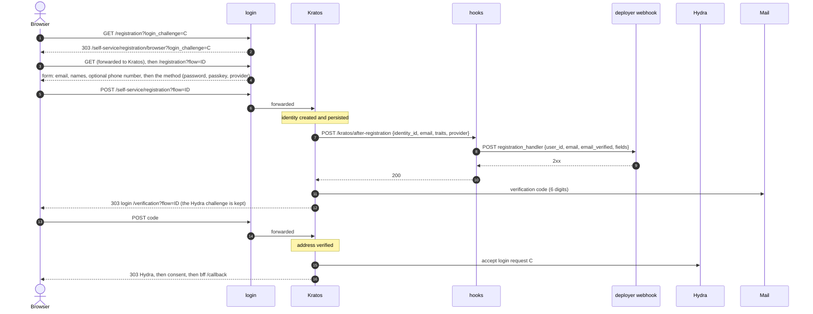

# Registration and email verification

Registration is a Kratos flow rendered by `login`, started from a Hydra login (the link on the login
page, or a provider sign-in with a new email). Kratos owns the identity, the verification codes and
the mail; `hooks` is called once the identity exists, to hand it to the deployer's service.

Relevant code:
- `login/src/pages.rs` -- `/registration`, `/verification`
- `hooks/src/server/api/after_registration.rs`, `hooks/src/profile_api.rs`,
  `hooks/src/webhook.rs` -- the registration hook
- `ory/kratos/kratos.yml` (verified-email-first), `ory/kratos/session-on-registration.yml`
  (the overlay), `ory/kratos/hooks/after-registration.jsonnet`, `ory/kratos/oidc/*.jsonnet`,
  `ory/kratos/courier-templates/`

## Verified-email-first

The default. Registration does not sign anyone in, and login refuses an unverified address:

- Each of `registration.after.password`, `.passkey` and `.oidc` is `[after-registration web hook,
  show_verification_ui]`; there is no `session` hook.
- `login.after.hooks` is `[require_verified_address]`.

If the provider's claims leave a required trait empty (`first_name`, `last_name`, `email`), Kratos shows the
registration page again; login renders the traits the provider left out (or sent invalid) and Kratos'
"Continue" button as one form, and submitting it finishes the sign-up. The address the provider asserted is
not an input there: Kratos keeps it, so it stays verified. A hand-made post that names another address
gets an identity with that address *unverified*. Kratos then makes it verify before any session
(unless `KRATOS_SESSION_ON_REGISTRATION` is set; see the
[verified-email-first section](../../ory/README.md#verified-email-first-base-and-its-overlay)).

A provider that returns `email_verified: true` in the id_token skips the code: the mapper
(`ory/kratos/oidc/*.jsonnet`) marks the address verified only then, and the flow continues to
Hydra directly.

What the hook does (`POST /kratos/after-registration`, called after the identity is persisted,
authorized by `WA_HOOKS_API_KEY`):

1. Takes `traits` minus `email` as `fields`. With the shipped schema that is `first_name`,
   `last_name` and `phone_number`; extra fields a deployer asks for must be added to
   `ory/kratos/identity.schema.json` (it has `additionalProperties: false`).
2. For a provider sign-up (`provider` is the id from the callback URL), runs the provider's
   `profile_apis` from `config.yaml`, if any. It reads the access token Kratos stored for the
   identity through Kratos' admin API (`GET /admin/identities/{id}?include_credential=oidc`) and
   makes each configured `GET` with it, concurrently; the claim pointers' values are merged into
   `fields` (a later entry wins a clash). These values do not pass through the identity schema, so its
   patterns (the phone number's, for one) are not applied to them.
   - `required: false` (default): a failed call is logged and its fields left out; a pointer that
     finds nothing leaves just that field out.
   - `required: true`: a failed call, or a pointer that finds nothing, fails the registration.
   - `scope`: not enforced, the call is always made (hooks can't see the granted scopes; see the
     `profile_apis` section of the [README](../../README.md) for what that means and which Google scope
     the phone number needs).
   - If Kratos holds no access token for the identity, a `required` entry fails the registration
     and optional ones are skipped.
3. POSTs `{user_id, email, email_verified, fields}` to `registration_handler` (a deployer URL;
   https unless loopback; no redirects; an optional `bearer_token` is sent as `Authorization:
   Bearer`). `email_verified` is Kratos' view of the address: `false` for a password sign-up until
   the code is entered. Unset: nothing is called.
4. On failure it answers a 4xx (or 502 when the deployer service is down or the Kratos lookup
   failed) and **deletes the identity itself**, because Kratos runs this hook after persisting. The
   user sees Kratos' error page, and can register again. A deployer webhook answering `400`, `403`
   or `422` is a refusal (`422` to Kratos); anything else wrong with it (`401`, `404`, `429`, 5xx,
   a timeout) is `502`.

The deployer's endpoint must be idempotent per `user_id`: Kratos retries a failed hook, so the
webhook can see the same registration more than once. The webhook's `timeout_secs` must be at most
half of hooks' `request_timeout_secs`, or hooks refuses to start.

The first thing the hook does, when there is anything to call, is read the identity from Kratos.
Kratos retries a 5xx, and an identity a failed attempt deleted is gone on the retry: that answers
`410` (not retried, and the deployer is not called again for an identity that no longer exists).
Collecting and forwarding gets half of hooks' request timeout; past that the hook answers `504`
and deletes the identity, so a slow webhook (an invite-only gate, say) cannot leave a usable
identity behind when the request is cancelled.

The verification mail is Kratos' courier (`--watch-courier`) rendering
`ory/kratos/courier-templates/`: a 6-digit code, valid 60 minutes, with Kratos' own attempt limits.

## Logging in unverified

An unverified identity that logs in (password, passkey or provider) is not signed in: Kratos starts
a verification flow, mails a code, and leaves Hydra's login request unaccepted. The known gap:
entering the code in that login-started verification ends on Kratos' `/error` page, with the address
verified by then. The user signs in again and passes. See [login.md](login.md).

## Without verified-email-first

A second Kratos config file turns the behaviour off: `-c kratos.yml -c session-on-registration.yml`
(local-prod: `KRATOS_SESSION_ON_REGISTRATION=1` in `.env`). Also set `WA_REQUIRE_VERIFIED_EMAIL=false`
on hooks: by default (`true`) its token hook refuses to mint tokens for an unverified email, so
the users the overlay signs in would get no tokens. The overlay replaces the registration
after-hooks with `[after-registration web hook, session]` (it repeats the web hook, because a second
config file replaces arrays instead of merging them) and empties `login.after.hooks`.

Then password and passkey registration sign the user in at once, continue straight to Hydra and
consent, and end at bff's `/callback`. The verification mail is still sent, but nothing requires the
code: the address stays unverified until it is entered, and unverified users can log in. The
`email_verified` claim in the tokens follows the address, so a service that needs a verified email
checks the claim (with `WA_REQUIRE_VERIFIED_EMAIL=false` the token hook no longer does).

Two traps from how Kratos assembles hooks: registration's global `after.hooks` can only hold web hooks, and a
method's own hook list **replaces** the global one. A deployer who adds
`login.after.oidc.hooks` loses `require_verified_address` for provider logins.

## What the account holds afterwards

- The Kratos identity (traits: `email`, `first_name`, `last_name`, `phone_number`), and its
  credentials.
- The deployer's own record, keyed by the identity id, created by `registration_handler`. That id is
  the `sub` of every token.
