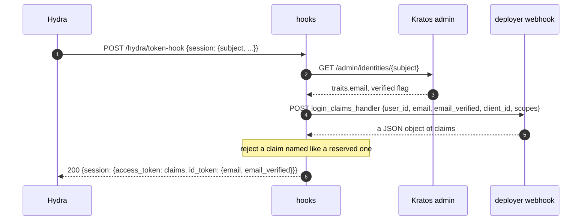
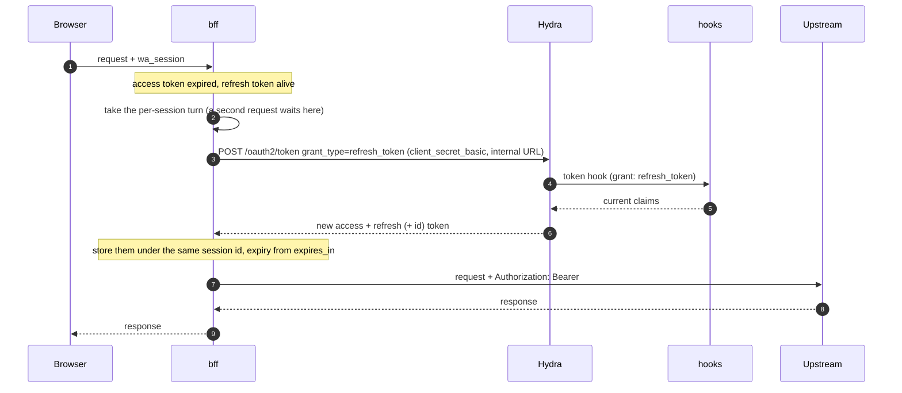

# Tokens, refresh and the proxy

After a login ([login.md](login.md)) the browser holds only `wa_session`. bff keeps the tokens and
spends them: every proxied request carries a Bearer JWT to the upstream, and bff refreshes it when it
has expired. The claims in that JWT are shaped by hooks, called by Hydra on every token mint.

Relevant code:
- `bff/src/server/api/proxy.rs` -- routing, session lookup, refresh, header rules
- `bff/src/server/refresh_lock.rs` -- single-flight refresh
- `hooks/src/server/api/token_hook.rs`, `hooks/src/webhook.rs` -- the claims
- `ory/hydra/hydra.yml` -- `strategies.access_token: jwt`, the token hook, TTLs, rotation

## What the access token carries

Hydra issues JWT access tokens (verifiable offline against its JWKS) with `iss` (the login host),
`sub` (the Kratos identity id), `aud`, `exp`, `iat`, `nbf`, `jti`, `client_id` and `scp`, plus what
the token hook adds. `aud` is `["weaveauth"]` (or whatever `WA_HYDRA_AUDIENCE` and the client's
audience say): Hydra only puts an audience there when the authorize request asks for it and consent
grants it, which bff and `login`'s `/consent` do.

**`POST /hydra/token-hook`** (hooks, called by Hydra on the code grant **and on every refresh**,
authorized with `WA_HOOKS_API_KEY`):

- `email` and `email_verified` come from Kratos on every mint, so a refresh sees a verified email
  as soon as it is verified. They are on the access token and the id_token.
- The access token also carries what `login_claims_handler` returns, if configured (`{user_id,
  email, email_verified, client_id, scopes}` in; `client_id` and `scopes` are the OAuth client and the
  requested scopes).
  `email_verified` is there because a user can change `traits.email` in settings and the new
  address is unverified: a handler that derives roles or a tenant from the email can check it.
  By default (`require_verified_email`, env `WA_REQUIRE_VERIFIED_EMAIL`, `true`) the hook refuses
  to mint for an unverified address, so the handler only sees verified ones; set it `false` with
  the session-on-registration overlay ([registration.md](registration.md)) and then the check is
  the handler's. Hydra
  puts a returned claim at the top level only if it is in `oauth2.allowed_top_level_claims`
  (`roles`, `email`, `email_verified` in the shipped config); any other name ends up under
  `ext`. Keep that list in step with the claims the webhook returns.
- A claim named like a registered or Ory-owned one (`iss`, `sub`, `aud`, `exp`, `nbf`, `iat`,
  `jti`, `email`, `email_verified`, `scp`, `scope`, `client_id`, `azp`, `cnf`, `act`, `may_act`,
  `typ`, `token_use`, `ext`, `sid`, `nonce`, `auth_time`, `acr`, `amr`, `at_hash`, `c_hash`,
  `rat`) is refused, so a webhook cannot spoof identity, scope or audience.
- It fails closed. `403` (Hydra does not retry it) for an unknown subject, an identity that is not
  `active` (so a deactivated identity's refresh token stops minting tokens), an identity without an
  email, an unverified email (while `require_verified_email` is on) and a webhook answer with a reserved claim; `502` for a Kratos outage, a webhook error or a
  non-object or oversized (over 1 MiB) answer. Hydra then issues nothing.

## Proxying

bff's `config.yaml` `routes` list maps a `path_prefix` to an `upstream_url`. For a request whose path
is a prefix or under it (whole segments; longest prefix wins; a `/` route takes the rest):

1. A path with a `.` or `..` segment (`;` path parameters ignored, so `..;` counts), or an encoded `/` or `\`, is `404`.
2. A request that can change state (any method but `GET`, `HEAD` or `OPTIONS`) must come from a
   trusted origin (`Origin`, falling back to `Referer`: `WA_TRUSTED_ORIGINS` or bff's own), or it
   is `403`.
3. The `wa_session` cookie must name a session (`401` otherwise; a cookie sent twice names none).
4. If the access token is expired or within 5 seconds of it, bff refreshes it (below); a refresh
   token Hydra rejects (or one past its TTL) ends the session and is `401`; Hydra unreachable or
   failing, or bff's own client credentials rejected, is `502` and the session is kept.
5. The request is forwarded with the prefix stripped, `Authorization: Bearer <access token>` and
   only `Content-Type`, `Accept`, `Accept-Language` and the `If-*` conditionals of the client's headers
   (`REQUEST_HEADERS`); `Cookie`, `Upgrade`, any
   forwarding header and every other header are dropped, and bff adds no `X-Forwarded-*`.
   WebSocket handshakes are therefore not proxied.
6. The response keeps only `Content-Type`, `Content-Disposition`, `Content-Security-Policy`,
   `Cache-Control`, `Location`, `Vary`, `ETag`, `Last-Modified`, `WWW-Authenticate` and `Retry-After`;
   bff adds `X-Content-Type-Options: nosniff`, a `sandbox; frame-ancestors 'none'` CSP when the
   upstream sent none, and `Cache-Control: no-store` when the upstream sent none (`private` is added
   to one that leaves shared caching open). An upstream has 30 seconds to start answering (`504`)
   and a request body may be 10 MiB.

No matching route is `404`. Per-client rate limit on proxied routes: `rate_limit_proxy_max_attempts`
(YAML only; 600 a minute in `prod`, 6000 in `dev`), a bucket of its own.

CORS (`tower-http`): a trusted `Origin` gets `Access-Control-Allow-Origin` (exact match, never `*`) and
`Access-Control-Allow-Credentials: true` on every proxy response, errors included. Every `OPTIONS`
is answered by bff before the session check and the rate limit and is never proxied. Only
the headers bff forwards are allowed as request headers. The session cookie is `SameSite=Lax`, so CORS only
helps a frontend that is cross-origin but same-site as bff.

## Refresh

- **Single-flight per session.** Hydra rotates the refresh token on every use and treats a spent
  one presented again as theft, revoking the whole chain. So bff lets one refresh per session run at
  a time; a concurrent request waits, then finds a fresh token and uses it. Hydra's own tolerance
  (`rotation_grace_period: 10s`, `rotation_grace_reuse_count: 2`) only covers a lost response.
- The session's `refresh_expires_at` is `WA_HYDRA_REFRESH_TOKEN_TTL_SECS` (default 30 days = Hydra's
  `ttl.refresh_token` of 720h; **set both to the same value**) after the last refresh that rotated
  the refresh token (a refresh that returns none keeps the old expiry). A session also ends 30 days
  after its login, however often it refreshed. The `wa_session` cookie's `Max-Age` is set once at
  login, to the shorter of the two, and is not renewed; past it the user logs in again.
- A user keeps at most 20 sessions: the 21st login ends the oldest (dropped, its refresh token
  revoked at Hydra).
- bff decides by the OAuth `error` field of Hydra's answer, not its status. `invalid_grant`,
  `token_inactive` and `access_denied` end the session (`401`). `invalid_client` and
  `unauthorized_client` (bff's own credentials are wrong) are `502`, logged at error, with the
  session kept. Anything else is `502` with the session kept.
- A refresh that succeeds after the user logged out in the meantime revokes the new tokens instead
  of storing them.
- Access tokens last 15 minutes in the shipped Hydra config. A change to the claims (a new role) shows
  up in the next refreshed token, not before.
